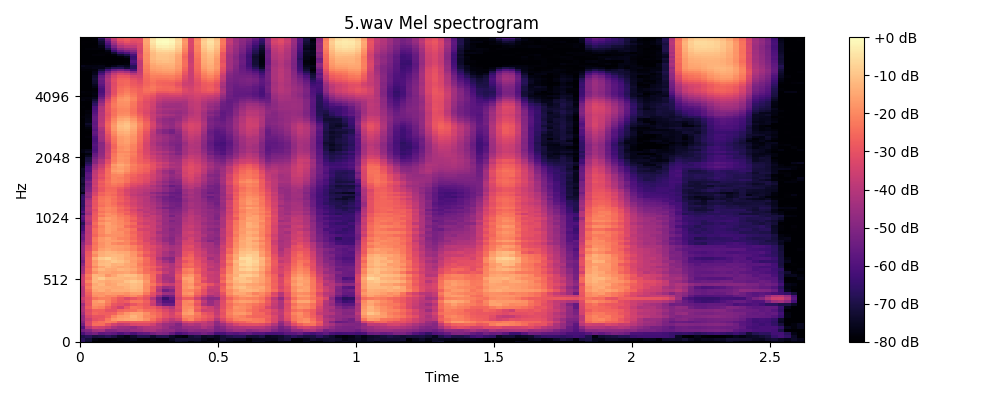
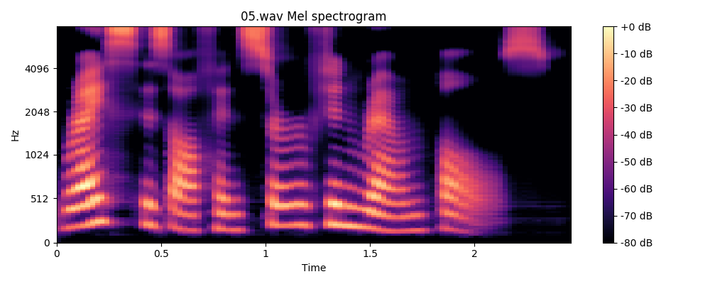

# A TensorFlow Implementation of DC-TTS: yet another text-to-speech model

fork of kyubong's [TensorFlow Implementation of DC-TTS](https://github.com/Kyubyong/dc_tts)

from [Efficiently Trainable Text-to-Speech System Based on Deep Convolutional Networks with Guided Attention](https://arxiv.org/abs/1710.08969).

## Contact

fork maintained by derek@atlaslabs.ai

## Requirements
  * NumPy >= 1.11.1
  * TensorFlow >= 1.12.0
  * librosa
  * tqdm
  * matplotlib
  * scipy

## Changes from Kyubong

- data loading for python3 (remove `codecs` and other fixes as seen in issue #11)
- absolute paths to data (allow preprocessed files to be written to; read from specified absolute path)
- `argparse` for specifying task number and GPU (`train.py` and `synthesize.py`)
- allow custom sentences, output directory when generating, and output spectrograms as images

## Example

`rice is often served in round bowls`

text2mel: ~50K steps; SSRN ~15K steps

text2mel: ~70K steps; SSRN ~20K steps

## Data

### LJSpeech

1. download [LJ Speech Dataset 1.1](https://keithito.com/LJ-Speech-Dataset/)
2. rename `metadata.csv` to `transcript.csv` (*will update later...?*)
3. add absolute path to corpus do `hyperparams.py` as `data=<path>`

## Training

1. check corpus path in `hyperparams.py`
2. run `python(3.6) prepo.py` to create `mel` and `mag` subdirectories (this speeds up training a lot)
3. run `python(3.6) train.py -n 1` to train text2mel. use `-g` flag to specify GPU id.
4. run `python(3.6) train.py -n 2` to train SSRN (mel upscaling). use `-g` flag to specify GPU id.
5. note: both training can be run together using separate GPUs

## Monitoring

`tensorboard` can be used to monitor training by specifying the log directory (for LJS, `LJ01-1` and `LJ01-2`), e.g.:

`tensorboard --logdir=/home/derek/PythonProjects/dc_tts/logs/LJ01-1 --port=9999`

## Synthesis

1. run `python(3.6) synthesize.py`, specifying GPU with `-g`, file with `-f` (format like harvard_sentences.txt), output dir with `-o`

the *default* file and output are specified in `hyperparams.py`

the spectrograms are also written as images

## (from Kyubong master) Notes

  * The paper didn't mention normalization, but without normalization I couldn't get it to work. So I added layer normalization.
  * The paper fixed the learning rate to 0.001, but it didn't work for me. So I decayed it.
  * I tried to train Text2Mel and SSRN simultaneously, but it didn't work. I guess separating those two networks mitigates the burden of training.
  * The authors claimed that the model can be trained within a day, but unfortunately the luck was not mine. However obviously this is much fater than Tacotron as it uses only convolution layers.
  * Thanks to the guided attention, the attention plot looks monotonic almost from the beginning. I guess this seems to hold the aligment tight so it won't lose track.
  * The paper didn't mention dropouts. I applied them as I believe it helps for regularization.
  * Check also other TTS models such as [Tacotron](https://github.com/kyubyong/tacotron) and [Deep Voice 3](https://github.com/kyubyong/deepvoice3).
  
